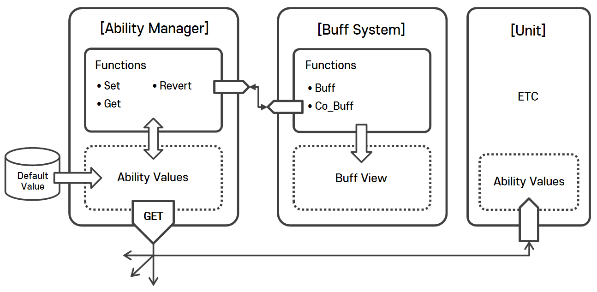

# Ability System & Buff System

#### ⦁ [Ability System]은 특정 물체의 능력(Ability)를 관리(수정)하는 시스템입니다. 

#### ⦁ [Buff System]은 특정 물체의 능력(Ability)에 효과(Buff)를 부여하는 시스템입니다. 

#### ⦁ [Buff System]은 [AbilitySystem]과 같이 연계되어 작동합니다. 

#### ⦁ Version 1.0 (2023.09.14)

### 1. 데모 이미지

    

### 2. 조건

- **[AbilitySystem]** 은 **프로젝트 전체에서 특정 물체의 능력(Ability)을 실질적으로 수정하는 역할**을 수행할 것

- **[BuffSystem]** 은 **특정 물체의 능력(Ability)을 수정하는 방아쇠(Trigger)역할**만 수행할 것

### 3. 메인 설계

    

- **Ability System 설계**

  - **능력치(Ability)** 를 관리하는 **[Ability Manager]** 가 존재, Get, Set, Revert를 통해 능력치(Ability)를 공유하도록 구현
 
  - 프로젝트 상의 **모든 능력치는 Ability System을 통해서만 수정 및 사용 가능**하도록 구현
 
  - **능력치의 관리의 주체를 통일 시키는 것이 목적**

    - **[Ability Manager](https://github.com/MinjunISAAC/AbilitySystem/blob/main/AbilitySystem/Assets/Game/Scripts/Ability/AbilityManager.cs)**

  - 능력치(Ability)는 **기본 값(Origin Value)를 가지고 있으며, 해당 기본값은 수정 및 변경되지 않도록 'Json File'으로 관리**

    - **[Ability Value](https://github.com/MinjunISAAC/AbilitySystem/blob/main/AbilitySystem/Assets/Game/Scripts/Ability/AbilityValue.cs)**
   
    - **[Ability Data](https://github.com/MinjunISAAC/AbilitySystem/blob/main/AbilitySystem/Assets/Utility/Default/DefaultAbilityData.cs)**

    - **[Default Data Json](https://github.com/MinjunISAAC/AbilitySystem/blob/main/AbilitySystem/Assets/Utility/Json/Resources/JsonSet/AbilityDefaultDatas.json)**
      
- **Buff System 설계**

  - **[Buff System]** 은 게임적 요소(능력치 향상)를 위해 **[Ability System]에 접근하여 특정 능력치(Ability)를 일정시간(Druation)안 효과**를 주도록 구현 

    - **[Buff System](https://github.com/MinjunISAAC/AbilitySystem/blob/main/AbilitySystem/Assets/Game/Scripts/Buff/UnitBuffSystem.cs)**
    

  - **[Buff View]** 는 [Buff System]에 종속되어 버프의 상태를 보여주도록 구현 
 
    - **[Buff View](https://github.com/MinjunISAAC/AbilitySystem/blob/main/AbilitySystem/Assets/Game/Scripts/Buff/UI/UnitBuffView.cs)**
    
